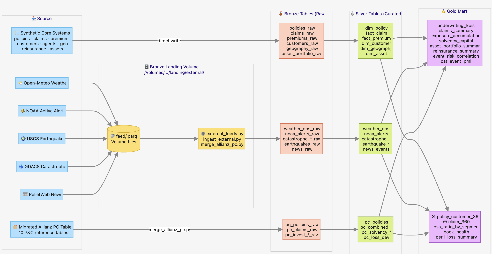
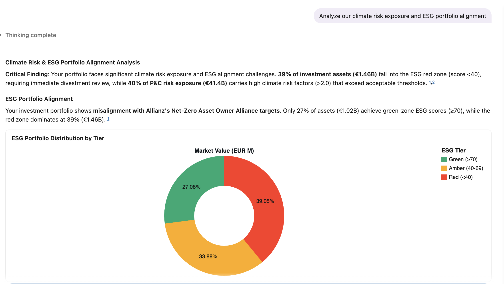
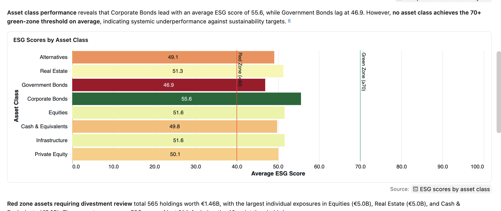

# Allianz Insurance Intelligence — Databricks Demo

End-to-end Databricks demo for **Allianz** spanning Personal Lines, Commercial
Lines, and Specialty Insurance. Generates synthetic data, scrapes real-time
weather + catastrophe feeds into a UC volume, ingests them into bronze, runs a
Lakeflow Declarative Pipeline through silver to gold, exposes a Genie Space for
NL Q&A and an AI/BI dashboard. Packaged as a Databricks Asset Bundle.

## Executive Summary

### Turning Your P&C Charter Into a Data Advantage

_Databricks for Loss Ratio, Claims & Risk — Allianz Property & Casualty_

#### The Challenge — Told Through a Day That Already Happened

A VP of Property & Casualty at Allianz has a charter that looks clear on paper: improve loss ratio, accelerate claims, tighten risk controls. The harder question is whether the data infrastructure underneath that charter can actually support it.

Here is a scenario that illustrates the gap — and the opportunity.

**The Setup.** The VP's team builds an agentic framework on Databricks that ingests external peril and market loss vectors — cat model feeds, NOAA storm tracks, ILS market pricing signals, claims frequency indices — for any line of business or geographic segment, pulling a rolling 36-month history. These are enriched with internal data: active policy exposure by zip code, open and closed claims, reserve movements, underwriting guidelines, reinsurance treaty terms, and a library of internal risk policy documents stored as PDFs (`/raw_data/incoming/Risk_Policy/2025_VAR_Guidelines.pdf`, `Underwriting_Appetite_Statement_CommercialProp.pdf`). The unified dataset is exposed through a natural language Q&A application — a Genie space — where any underwriter, actuary, or risk officer can ask questions without writing SQL.

**The Trigger.** In June 2025, the agentic framework surfaces an anomaly in the US Commercial Property book — specifically, the Gulf Coast wind-exposed sleeve. Loss frequency and severity vectors, which had tracked closely for 18 months, begin to decouple. The cat accumulation concentration vector rises 1.9x versus the 36-month baseline. Simultaneously, open claims in the affected segment show a +22% increase in average cycle time, and the book's combined ratio trajectory begins breaching the internal risk appetite threshold set for the current reinsurance treaty layer.

**The Root Cause.** The agent traces the divergence to a June 18, 2025 internal underwriting policy change — a tightening of flood zone eligibility criteria that inadvertently shifted a portion of the portfolio into a higher-risk, under-reinsured band. The policy update was captured in a governance document indexed in the Q&A layer. The agent surfaces it unprompted when asked: _"Why is the Gulf Coast book underperforming relative to the risk model?"_

**The Quantified Impact.** The framework answers in plain language and hard numbers:

- Loss ratio in the affected sleeve deteriorated by **+4.1 points** quarter-over-quarter
- Claims leakage attributable to extended cycle time: **+31 bps** on incurred loss
- Reserve strengthening requirement flagged: **+$18M** across the Gulf Coast wind segment
- Reinsurance recoverable gap: **$6.2M** below treaty attachment due to the reclassified policies

**The Point.** None of this required a data engineering sprint, a new dashboard request, or a week of actuarial analysis. It required a unified data foundation — policy, claims, risk, and documents in one governed layer — and an agent that could reason across all of it when the signal appeared.

That is what your charter on loss ratio, claims efficiency, and risk now demands. And it is exactly what Databricks delivers.

#### Pillar 1 — Loss Ratio: From Lagging Indicator to Real-Time Signal

**The problem:** Loss ratio is typically a backward-looking metric. By the time it is visible, the underwriting decisions that drove it are months old.

**What Databricks enables:** A unified lakehouse that connects policy, claims, pricing, and external data — giving underwriting and actuarial teams a live loss ratio view by segment, line, region, and peril. Continuous model updates replace annual reviews. Drift in pricing is caught in days, not quarters.

**Proof points:**

- A 1-point improvement in loss ratio is worth **£30–40M annually** for a carrier the size of Allianz UK
- Allianz UK Personal Lines reduced data refresh from **4+ hours to near-real-time**, enabling pricing and risk teams to respond to emerging loss trends the same morning
- Industry benchmarks: **2–3 pp** combined ratio improvement attributable to AI-driven claims and underwriting automation

#### Pillar 2 — Claims: Speed, Accuracy, and Cost as a Competitive Weapon

**The problem:** Claims is the largest cost center in P&C and the highest-leverage point for loss ratio improvement. Manual triage, fragmented data across systems, and batch-driven reporting create leakage at every stage.

**What Databricks enables:** An end-to-end claims intelligence platform — from First Notice of Loss through settlement — powered by real-time pipelines, AI triage models, fraud detection, and self-service dashboards for adjusters, operations, and leadership.

**Proof points:**

- **9x faster** claims processing (Nationwide on Databricks)
- **10x increase** in claims volume handled per adjuster (Chubb)
- **50% reduction** in processing cost and **2 weeks faster** settlement (Munich Re)
- **29% improvement** in fraud detection rates across major European insurance clients on the Databricks platform

#### Pillar 3 — Risk: Precision Exposure Management at Portfolio Scale

**The problem:** Risk accumulation is assessed too infrequently, too slowly, and with too little external data. Catastrophe exposure, geospatial concentration, and emerging risks like climate and cyber are not yet embedded in real-time underwriting or portfolio decisions.

**What Databricks enables:** Live Probable Maximum Loss (PML) tracking by joining policy exposure with real-time catastrophe feeds (NOAA, USGS, weather APIs). Dynamic loss simulations and stress testing in minutes. A single governed view of cat, attritional, and large-loss trends — across lines and geographies — with full Solvency II traceability.

**Proof points:**

- Allianz Insurance Intelligence platform (built on Databricks) delivers real-time exposure accumulation by state, underwriting KPIs, loss triangles, and cat event PML — all from a single unified lakehouse
- Risk segmentation models running on Databricks can ingest **1,000+ external risk factors** for pricing precision
- Allianz Group is actively scaling **400+ AI use cases** on Databricks — with governance and explainability baked in

#### Why Databricks — And Why Now

| Capability | What It Means for Your Charter |
| --- | --- |
| Unified Lakehouse | One platform for policy, claims, risk, and actuarial — no silos, no duplication |
| Real-Time Pipelines | Loss ratio and exposure visible in near-real-time, not next morning |
| AI/BI + Genie | Self-service analytics for claims ops, underwriters, and portfolio leaders |
| Mosaic AI | Production ML for triage, fraud, pricing — with full MLflow governance |
| Unity Catalog | End-to-end lineage from data to model to decision — Solvency II ready |
| Proven at Allianz | Allianz UK, Allianz Global Investors, Allianz Re, Allianz Partners — all on Databricks |

#### The Conversation Worth Having

Allianz P&C already has the data. The bottleneck is access, speed, and trust in that data — and the ability to act on it before the loss is locked in.

A focused 30-minute conversation can map your specific loss ratio, claims, and risk priorities to concrete, measurable capabilities already deployed across the Allianz group — and define what a proof-of-value engagement would look like in your environment.

**Saswata Sengupta** · Sr. Solutions Architect, Databricks · saswata.sengupta@databricks.com

## Live Resources

| Resource    | URL                                                                                                                                                                  |
| ----------- | -------------------------------------------------------------------------------------------------------------------------------------------------------------------- |
| Workspace   | <https://fevm-serverless-stable-xhky6g.cloud.databricks.com>                                                                                                         |
| Catalog     | `serverless_stable_xhky6g_catalog`                                                                                                                                   |
| Schemas     | `allianz_bronze` · `allianz_silver` · `allianz_gold`                                                                                                                 |
| Landing volume | `/Volumes/serverless_stable_xhky6g_catalog/allianz_bronze/landing/external/<feed>/`                                                                              |
| DLT pipeline | `Allianz Insurance — Silver/Gold DLT`                                                                                                                              |
| Full refresh job | `Allianz — Full Refresh (data gen → external land → bronze ingest → DLT)`                                                                                      |
| Hourly feeds job | `Allianz — External Feeds (hourly)`                                                                                                                            |
| Dashboard   | [Allianz Insurance Intelligence](https://fevm-serverless-stable-xhky6g.cloud.databricks.com/dashboardsv3/01f152dad34010d48251741cd17e7e33)                            |
| Genie       | [Allianz Insurance Intelligence — Genie](https://fevm-serverless-stable-xhky6g.cloud.databricks.com/genie/rooms/01f152db5ad41c1c91ec9f08ca683bc3)                     |

## Architecture

<p align="center">
  
</p>

Source: [`docs/diagrams/architecture.mmd`](docs/diagrams/architecture.mmd) (Mermaid). See [`architecture.svg`](docs/diagrams/architecture.svg) for the vector version.

<details>
<summary>ASCII view</summary>

```
Sources                          Bronze landing volume         Bronze tables       Silver tables       Gold marts
──────────────────────────────────────────────────────────────────────────────────────────────────────────────────
Synthetic core systems ──┐                                ┌──► policies_raw      ┌──► dim_policy     ┌──► underwriting_kpis
(policies, claims,       │                                │    claims_raw        │    fact_claim     │    claims_summary
 premiums, customers,    │                                │    premiums_raw      │    fact_premium   │    exposure_accumulation
 agents, geo,            ├──── direct write ──────────────┤    customers_raw     │    dim_customer   │    solvency_capital
 reinsurance, assets)    │                                │    geography_raw     │    dim_geography  │    asset_portfolio_summary
                         │                                │    asset_portfolio_raw│   dim_asset      │    reinsurance_summary
                         │                                │    ...               │    ...            │    event_risk_correlation
                         │                                │                      │                   │    cat_event_pml
Open-Meteo weather ──────┤   ┌────────────────────────┐   │    weather_obs_raw   │    weather_obs   │
NOAA active alerts ──────┼──►│ /Volumes/.../landing/  ├──►│    noaa_alerts_raw   │    noaa_alerts   │    policy_customer_360  ◀── joined view
USGS earthquakes ────────┤   │   external/<feed>/.parq│   │    catastrophe_*_raw │    catastrophe_*  │    claim_360            ◀── joined view
GDACS catastrophes ──────┤   └────────────────────────┘   │    earthquakes_raw   │    earthquake_*   │    loss_ratio_by_segment
ReliefWeb news ──────────┘    (external_feeds.py)          │    news_raw          │    news_events    │    book_health          ◀── P&C KPIs
                              (ingest_external.py merges)  │                      │                   │    peril_loss_summary
                                                           │                      │                   │
                                                           │    pc_policies_raw   │    pc_policies   │
Migrated allianz_pc tables ────────► merge_allianz_pc.py ─►│    pc_claims_raw     │    pc_combined_* │
(10 P&C reference tables)                                  │    pc_invest_*_raw   │    pc_solvency_* │
                                                           │    ...               │    pc_loss_dev   │
                                                           └─────────────────────┘    ...           │
```

</details>

## Dashboard Preview

Sample views from the [Allianz Insurance Intelligence dashboard](https://fevm-serverless-stable-xhky6g.cloud.databricks.com/dashboardsv3/01f152dad34010d48251741cd17e7e33) and Genie space — climate-risk and ESG portfolio analytics on the gold marts.

<p align="center">
  
</p>

<p align="center">
  
</p>

## Schemas

| Schema           | Purpose                                                  | Tables |
| ---------------- | -------------------------------------------------------- | ------ |
| `allianz_bronze` | Raw landing — synthetic + external (post-volume-merge) + migrated P&C raw | 19 |
| `allianz_silver` | Conformed dims/facts, external silver, P&C reference data | 24 |
| `allianz_gold`   | Business marts (KPIs, joined 360 views, segment loss ratio, book health) | 13 |

## Lines of Business

| LOB         | Products                                                                |
| ----------- | ----------------------------------------------------------------------- |
| Personal    | Auto · Home · Life · Renters · Umbrella                                 |
| Commercial  | Property · General Liability · Workers Comp · D&O · Professional Liability |
| Specialty   | Marine · Aviation · Cyber · Environmental Liability · Energy            |

## Reusable SQL — `sql/`

| File                              | Purpose                                                            |
| --------------------------------- | ------------------------------------------------------------------ |
| `01_underwriting_kpis.sql`        | GWP / NWP / loss / expense / combined ratio by LOB & month        |
| `02_book_health.sql`              | Policy count, GWP, frequency per 100, severity, loss ratio        |
| `03_loss_triangle.sql`            | Accident-year × dev-period loss triangle (IBNR, ultimate loss)    |
| `04_solvency_ii.sql`              | SCR breakdown, own funds, solvency ratio, regulatory status        |
| `05_cat_pml_exposure.sql`         | Live catastrophe events × per-state TIV → PML estimate            |
| `06_segment_loss_ratio.sql`       | Worst-performing LOB × product × state × channel × customer_type   |
| `07_claim_360.sql`                | Claim + policy + customer + geography in one row                   |
| `08_reinsurance_recoveries.sql`   | Ceded premium by reinsurer (USD + EUR books)                       |
| `09_combined_ratio_vs_benchmark.sql` | Sub-line combined ratio vs published industry benchmarks         |
| `10_realtime_event_risk.sql`      | NOAA active alerts × exposed TIV                                   |

Verify all SQL queries against the warehouse:

```bash
uv run --no-project scripts/smoke_test_sql.py
```

## Genie — industry-standard P&C content

The Genie space at the link above includes:

- **30 attached tables** spanning core silver dims/facts, all 10 P&C reference
  tables, 2 live event feeds, and all 13 gold marts.
- **11 instructions** covering Lines of Business, Glossary, Industry Benchmarks
  (Combined Ratio · Frequency/Severity · Solvency II · Reinsurance), Table
  Guidance, Joining Tables, Reporting Conventions, Data Freshness, and a
  How-do-I FAQ.
- **29 curated example questions** across underwriting / profitability, claims,
  exposure, solvency, reserving (loss triangles), reinsurance, assets,
  real-time event risk, and customer / channel mix.

## Running Locally

```bash
# 1. Authenticate
databricks auth login --host https://fevm-serverless-stable-xhky6g.cloud.databricks.com \
  --profile fe-vm-fevm-serverless-stable-xhky6g

# 2. Generate synthetic data → allianz_bronze
uv run --no-project --with polars --with numpy --with mimesis \
  --with "databricks-connect>=16.4,<17.0" \
  src/generate_data.py

# 3. Pull external feeds → UC volume
uv run --no-project --with polars --with httpx src/external_feeds.py

# 4. Merge volume files → allianz_bronze.*_raw
uv run --no-project --with "databricks-connect>=16.4,<17.0" src/ingest_external.py
```

## Deploying via DAB

```bash
databricks bundle validate --profile fe-vm-fevm-serverless-stable-xhky6g
databricks bundle deploy   --profile fe-vm-fevm-serverless-stable-xhky6g
databricks bundle run      allianz_full_refresh --profile fe-vm-fevm-serverless-stable-xhky6g

# Build & deploy the dashboard and the Genie space
uv run --no-project --with httpx scripts/build_dashboard.py
uv run --no-project scripts/build_genie.py
```

## Brand Guidelines

| Element       | Value                                |
| ------------- | ------------------------------------ |
| Primary       | `#003781` (Allianz Blue)             |
| Secondary     | `#006192` (Allianz Light Blue)       |
| Accent        | `#96DCFA` Sky · `#FFAB00` Gold       |
| Font          | Allianz Neo (fallback: Inter)        |
| Voice         | Trustworthy, precise, regulator-aware |
